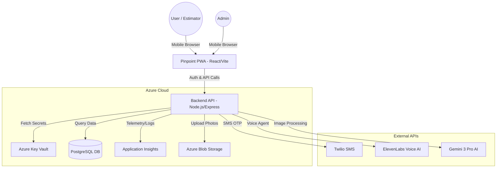
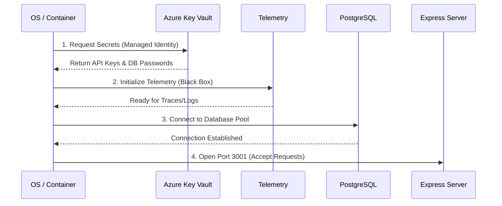

# Pinpoint Painting App - Architecture & Infrastructure

## Overview
A premium, mobile-first PWA for painting contractors to manage customers, generate voice-driven estimates, and visualize colors using AI.

## System Architecture Diagram

## Bootstrap Sequence (Reliability Layer)
To ensure no "race conditions" or partial startups, the backend follows a strict, sequential bootstrap process.

## Infrastructure (Azure)
- **Resource Group**: `Zach` (eastus2)
- **Frontend**: Azure Container App (`pinpoint-app`)
- **Backend**: Azure Container App (`pinpoint-backend`)
- **Database**: Azure Database for PostgreSQL Flexible Server (`pinpoint-db.postgres.database.azure.com`)
- **Storage**: Azure Blob Storage (`pinpointpaintphotos`)
- **Secrets Management**: Azure Key Vault (`pinpointpaint-vault`)
  - **Managed Identity**: System-Assigned ID on the backend. Zero-Trust access.
- **Observability**: Azure Application Insights (`pinpoint-insights`)
  - Full request tracing, performance monitoring, and error logging.

## Security & Data Policy
- **Authentication**: SMS-based OTP via Twilio Verify.
- **Session Policy**: 7-day inactivity sliding window.
- **RBAC (Role Based Access Control)**:
  - **Admins**: See all customers and estimates across the company.
  - **Estimators**: Only see their own customers and estimates (Private by default).
- **Data Sharing**: Peer-to-peer sharing allowed via the `estimate_shares` table.
- **Secrets**: 100% of sensitive keys are in Key Vault. No `.env` secrets in production.

## Database Schema (Relational)
The system uses a normalized relational schema in PostgreSQL to support scaling and complex line-item reporting.
- `users`: Identity and roles.
- `customers`: Client CRM records (owned by users).
- `estimates`: Header records for jobs.
- `estimate_items`: Individual room/area breakdowns (The "Line Items").
- `estimate_shares`: Collaborative access mapping.

## Deployment Flow
1. `az acr build`: Compiles the ARM64 code into an AMD64 Linux image.
2. `az containerapp update`: Triggers a rolling update (Zero-downtime).
3. `bootstrap()`: Backend performs the sequence above before accepting traffic.
